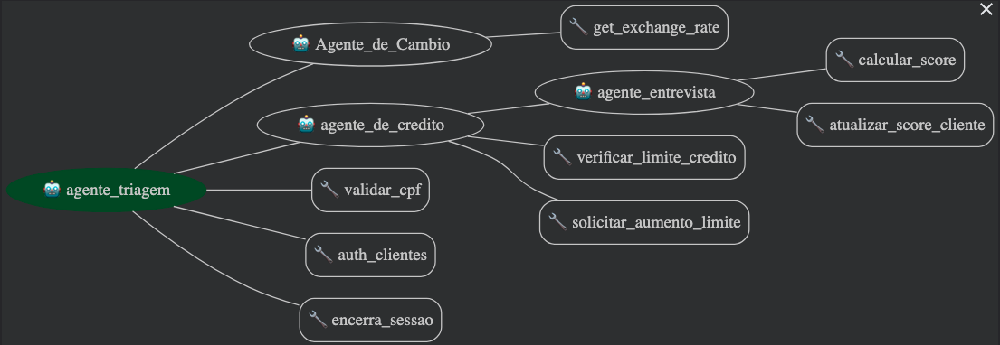

# Desafio Técnico: Agente Bancário Inteligente

## Visão geral do projeto
O projeto chamado "Banco Ágil" visa demonstrar a construção de um agente de inteligência artificial, seguindo os requisitos principais do exercício, construindo:

- Agente de Triagem: Autentica o cliente e direciona para o agente apropriado.
- Agente de Crédito: Informa sobre limites de crédito e processa solicitações de aumento de limite.
- Agente de Entrevista de Crédito: Conduz uma entrevista financeira para atualizar o score de crédito.
- Agente de Câmbio: Realiza consulta de cotação de moedas através de uma API pública.


## Estrutura do projeto

```
banco_agil/ 
|---dados/ #Possui as informações sobre a "base de dados" dos clientes
|---.env-example #Variáveis de ambiente, necessário popular com chaves de API e renomear para ".env"
|---agent.py  #Agente principal, também chamado de "Agente de triagem"
|---ferramentas_triagem.py   #Ferramentas (funções em python) do agente de triagem
|---agente_cambio.py  #Agente de câmbio, responsável pela tratativa de conversão de moedas
|---ferramentas_cambio.py   #Ferramentas (funções em python) do agente de câmbio
|---agente_credito.py   #Agente de crédito - Responsável por informar limites do cliente e processar solicitações de aumento de limite
|---ferramentas_credito.py   #Ferramentas (funções em python) do agente de crédito
|---agente_entrevista.py   #Agente de entrevista - Responsável por conduzir uma entrevista financeira para atualizar o score de crédito
|---chat.html # Um HTML simples com um javascript que simula a interface web de um chat. (Pode-se fazer o trace na interface direta do Google ADK nativo)

```

## Tecnogia e Ferramentas

### Framework Google ADK
Escolhido por ser modular, utilizar a linguagem Python, compatível com diversos tipos de LLMs (inclusive Ollama), e atender à requisição de Multi-agents e Workflow agent.

### Linguagem Python
Escolhida por ser de natureza alto nível (acelerando o desenvolvimento), ser uma das com robusta presença no ADK e de maior suporte na comunidade. 

## Arquitetura
A arquitetura desenvolvida contempla agentes Coordenados usando o ADK (Agent Development Kit) do Google, com um Agente de Triagem (Root Agent) que roteia a conversa para um Agente de Câmbio, um Agente de Crédito e um Agente de Entrevista de Crédito. 



## Escolhas técnicas

### Front-end
Como Front-end, um html com Javascript foi utilizado para acessar os agentes em Python, bastando abrir o arquivo chat.html no broswer local, ele acessará o endereço do Google ADK em http:127.0.0.1:8000. 
Para efeitos de desenvolvimento, usou-se a interface http, diretamente no localhost na porta 8000, uma funcionalidade do ADK que facilita a visão do fluxo de mensagens. 

### LLM
Para fins de teste, a API do Google (gemini-2.5-flash) free tier foi utilizada. 
Além de possuir um free-tier, o LLM foi escolhido principalmente pela sua compatibilidade, integração nativa, e o ecossistema oferecido pelo Google. 


### APIs
Demais APIs utilizadas:
- API em frankfurter.app para obter a cotação de câmbio sem a necessidade de cadastro ou token


# Funcionalidades implementadas
## 1 - O Agente de triagem 
É o responsável pela primeira interação, ele é responsável por questionar o CPF e a data de nascimento do cliente do banco. Ele também é responsável por rotear o usuário para o Agente de Câmbio (2) e o Agente de crédito (3).
### 1.1 - Validação de CPF
Ele valida o CPF (validar_cpf) antes de buscar na "base de dados" para minimizar os recursos de sistema (BD). Neste ponto, para efeitos de teste, serão validados CPFs de acordo com as regras oficiais, EXCETO os dígitos contínuos para efeitos do exercício proposto, pois usaremos CPFs deste tipo para os testes. Esta parte do código está comentada para habilitação futura.
### 1.2 Autenticação de usuário
O agente de triagem é responsável por autenticar o usuário (auth_clientes) na base de dados "clientes.csv". A base de dados está previamente populada com CPFs de teste e outros parâmetros. Uma vez que o usuário é autenticado, como a leitura do banco já foi feita, as informações de Score e Limites são lançadas em variáveis de contexto para acesso de outros agentes.

## 2 - Agente de Câmbio
O Agente de Câmbio é o responsável por buscar através de uma API aberta em frankfurter.app pelas informações de câmbio. Ele extrai do cliente, através de LLM, a cotação da moeda necessária. Depois de fazer a conversão usando a ferramenta exchange_rate e depois provê a informação. Uma vez que o cliente não precisa mais de nenhuma informação de câmbio, ele automaticamente roteia para o Agente de triagem novamente.

## 3 - Agente de crédito
O agente de crédito é o responsável por informar o limite de crédito, criar a solicitação de um novo limite, checar o Score do cliente, aprovar/reprovar novo limite e redirecionar o cliente para o agente de entrevista de crédito caso necessário.
### 3.1 Informar o limite de crédito 
O Agente, quando solicitado, é capaz de verificar a informação de limites do cliente. Como o Agente de Triagem já acessou a base de dados para autenticar o cliente e colocou as informações em variáveis de contexto, basta usá-las para manter o cliente informado usando a ferramenta credit_limit_tool.
### 3.2 Aumentar o limite
O Agente, quando solicitado por aumento de crédito, ele utiliza a ferramenta credit_raise_tool para verificar se o Score do cliente é suficiente para o aumento de crédito, cria o pedido (registrando no banco de dados solicitacoes_aumento_limite.csv) e automaticamente aumenta o limite de crédito do cliente na base de dados clientes.csv. 
Caso o cliente não possua Score suficiente, ele registra o pedido no banco de dados como rejeitado, pergunta se o mesmo gostaria de realizar uma entrevista de credito, em caso positivo redireciona o cliente para o Agente de Entrevista de Crédito.
### 3.3 Agente de entrevista de Crédito
O Agente é responsável por realizar uma entrevista, que são perguntas sequenciais, armazenar em memória e usar a ferramenta calcular_score_tool com esses parâmetros. Uma vez que recebe o resultado, informa ao cliente e atualiza o Score do mesmo usando a ferramenta atualizar_score_cliente_tool e em seguida redireciona para o Agente de crédito que oferece realizar a consulta de aumento de limite novamente.


Durante todo o processo, o cliente pode solicitar encerrar a sessão, sendo atendido prontamente pelo Agente. 


# Desafios enfrentados e como foram resolvidos.
A escolha do ADK foi adequada, mas exigiu uma curva de aprendizado inicial que foi facilitada pelo conhecimento de desenvolvimento de software e da linguagem escolhida. 
O ADK é um desenvolvimento relativamente novo, possuindo alterações no código rápidas que impactam nos métodos implementados e nas biblitecas fornecidas. Comecei a implementar o agente de entrevista tentando usar um "Workflow Agent", no entanto este não era mais existente na última versão da biblioteca, o que me levou a usar um agente Lllm com regras de contexto por prompt. 

Comecei a adaptar um código anterior para servir de interface, conforme solicitado nos requerimentos do exercício. No entanto, o acesso http local ao Google ADK não funcionava conforme esperado. Passei um tempo estudando o código, olhando bloquadores do browser, e até firewall da maquina local. Após pesquisa, entendi que o erro de negação do recurso estava no próprio ADK que proíbe requisições com origem "null" pela política CORS. A razão é que coloquei o Javascript em um HTML comum aberto pelo browser, portanto ele não tinha o Origin. 
A solução para testes foi iniciar o ADK com a opção "--allow_origins "*" ". 


# Tutorial de execução e testes.

Para executar os testes, a recomendação é utilizar a máquina local para rodar o Google ADK. 

## Pre-requisitos

### Python 3.10 ou mais atual
### pip para instalar pacotes 
Caso não tenha o pip instalado, refira-se a esta documentação:
https://pip.pypa.io/en/stable/installation/


## Instalação do Google ADK

Crie e ative o Python Virtual Environment (Recomendado)

Para isto, entre no diretório onde a pasta banco_agil se encontra (não dentro dela) e execute:

```
python -m venv .venv
```

Ative o ambiente virtual (Linux/Mac)
```
source .venv/bin/activate
```

Caso esteja usando Windows, ative dessa maneira:
```
.venv\Scripts\activate.bat
```

Agora instale o ADK:
```
pip install google-adk
```

Dentro do diretório "banco_agil" copie o arquivo .env-example para .env
Edite a variável GOOGLE_API_KEY com uma chave API do google válida. Caso não tenha, obtenha uma conforme explicado aqui:


Pode executar o agente Banco Ágil execute este comando na pasta anterior à banco_agil:
```
adk web --port 8000 --allow_origins "*"
```

Se acessar http://127.0.0.1:8000 , acessará a interface de desenvolvimento do agente, podendo visualizar as interações e demais informações do agente.
Uma interface simples foi adaptada para simular um ambiente de chat com atendente virtual, abra o html banco_agil/chat.html no seu browser e utilize o chat para conversar com o agente.


